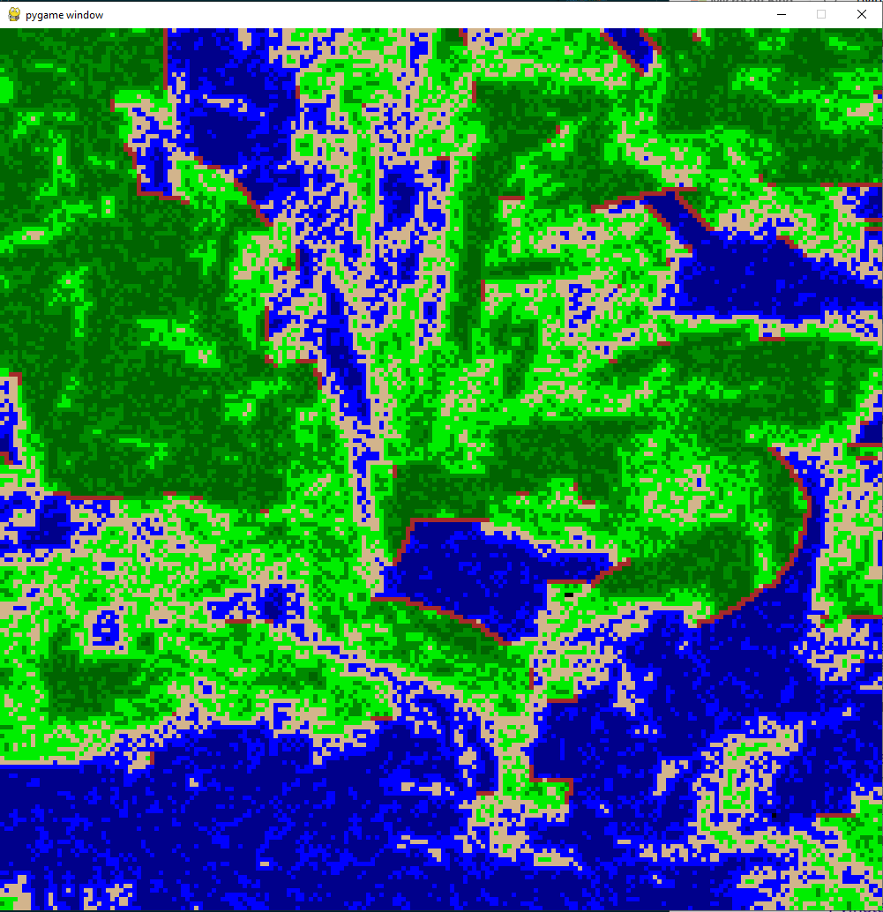

# wave-function-collapse
Foray into wave function collapse

Very simple wfc attempt to generate terrain. Currently, math is kinda funky, but it works pretty good.  

Working on a couple of terrain exploration algorithms, but the most fun so far (and what the code currently does) is drawing! Simply click and drag (start from the center).  

Here's an example:
